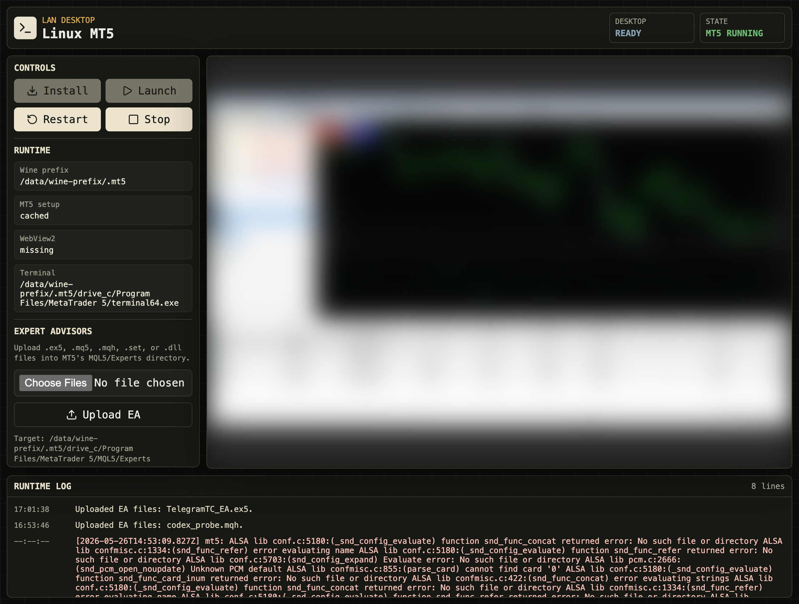

# MT5 Dockerized

Current release: `1.2.1`.

This repo runs MetaTrader 5 from Docker. The current preferred setup is the
Linux/Wine container in `linux/`: it auto-installs MT5 unattended on first boot,
gives you a browser-accessible MT5 desktop, a small control UI, a self-healing
desktop supervisor, a Docker healthcheck, EA upload support, optional EA
autoload through MT5's own `common.ini`, an optional S3 sync for exported tick
CSVs, and a raw VNC endpoint for local streaming tools.

The Windows container in `windows/` is still available, but treat it as the
fallback. Use it only when you really need Windows compatibility, because it
uses multiple GB of RAM compared with the much lighter Linux/Wine setup.



*The Linux control UI: launch / restart / stop controls, runtime status, EA
upload, the embedded noVNC desktop (blurred here), and a live runtime log.
Install is automatic, so there is no Install button.*

## Layout

```text
linux/
  Wine-based MT5 desktop with Bun/React control UI, noVNC, raw VNC, and EA
  upload support.

windows/
  Windows 11 setup using dockur/windows for full Windows MT5 compatibility.
```

## Recommendation

Start with Linux/Wine for custom EAs that you compile yourself. The working
setup here is:

1. Run the Linux container — it auto-installs MT5 unattended (`mt5setup.exe
   /auto`) and auto-launches it. No clicking required.
2. Log into your broker in the noVNC desktop.
3. Upload the compiled `.ex5` through the control UI (or mount it).
4. Use a local Compose override if you want the container to manage
   `common.ini`, write the EA preset, and autoload the EA at launch.

Use Windows only for cases that Wine cannot satisfy, such as MQL5 Market EAs,
native Windows DLL dependencies, DRM/anti-tamper checks, broker-specific
Windows behavior, or full desktop compatibility.

If MT5 reports this error, the issue is the EA build or host CPU capability,
not the upload path:

```text
your CPU architecture does not allow to run the file 'TelegramTC_EA.ex5':
AVX2 required, you have AVX only
```

Rebuilding the EA as a regular x64 `.ex5` avoided that specific failure in this
setup.

## Resource Shape

| Setup   | Approximate Disk | RAM Shape | Notes |
|---------|------------------|-----------|-------|
| Linux   | 3-8 GB           | Hundreds of MB | Wine prefix, MT5 install, lightweight desktop |
| Windows | 12-20 GB         | Multiple GB | Full Windows VM plus MT5 |

## How The Linux App Works

The Linux container starts:

- `Xvfb` for the virtual display.
- `openbox` for window management.
- `x11vnc` for raw VNC.
- `websockify` and noVNC for browser access.
- A Bun API and React control UI.
- Wine, which runs the MT5 installer and `terminal64.exe`.

The entrypoint clears stale X locks before starting Xvfb (so `docker restart`
never hits "Server is already active for display N") and runs a watchdog that
restarts Xvfb/openbox/x11vnc/websockify if any of them die. The container also
auto-installs MT5 on first boot (`AUTO_INSTALL_MT5`, default on) and exposes a
Docker `HEALTHCHECK` on `/api/status`.

The persisted MT5 install lives inside the mounted data directory:

```text
/data/wine-prefix/.mt5
```

On the home server used for this setup:

```text
Control UI: http://192.168.0.100:17300
noVNC:      http://192.168.0.100:17080/vnc.html?autoconnect=1&resize=scale&path=websockify
Raw VNC:   192.168.0.100:15900
```

Use the control UI for launching, stopping, restarting, and uploading EA files
(install is automatic). Use noVNC when you need to operate the MT5 desktop in a
browser. Use raw VNC for local streaming tools such as `rdp-stream-studio`;
do not point VNC clients at the noVNC browser URL.

## Tick CSV → S3 sync (optional)

The container can mirror exported tick CSVs to S3. It is off by default; enable
it with `S3_SYNC_ENABLED=true` and `S3_URI`. Save MT5's tick export into the
directory mapped to `S3_SYNC_SOURCE_DIR` (default `/data/exports`) and a loop
runs `aws s3 sync` of `*.csv`, deferring while a file is still being written. On
EC2 it uses the instance role (no keys, IMDS hop limit >= 2); off-AWS, supply
`AWS_*` credentials. See `linux/README.md` and
`linux/docker-compose.override.yml.example`.

## EA Uploads

The web app uploads EA-related files through `POST /api/mt5/experts`. The upload
button writes `.ex5`, `.mq5`, `.mqh`, `.set`, and `.dll` files into the active
MT5 `MQL5/Experts` directory.

On a fresh MT5 install, upload may fail until MT5 has been launched once. That
first launch lets MetaTrader create the terminal folders. After that, the upload
panel should show a `Target:` path and the upload button should work normally.

The official MetaQuotes installer can use this portable-style layout:

```text
/data/wine-prefix/.mt5/drive_c/Program Files/MetaTrader 5/MQL5/Experts
```

Some broker-branded installers use the roaming terminal layout:

```text
/data/wine-prefix/.mt5/drive_c/users/root/AppData/Roaming/MetaQuotes/Terminal/<terminal-id>/MQL5/Experts
```

The app checks both layouts. The `Target:` value in the upload panel is the path
the app is actually writing to.

## EA Autoload And common.ini

The shared `linux/docker-compose.yml` intentionally does not list account- or
EA-specific `MT5_STARTUP_*` and `MT5_EA_*` variables. Keep those in a local
`linux/docker-compose.override.yml` file so link codes, account-specific inputs,
and EA settings stay out of git.

Example local override. This is a worked example for one specific EA named
`TelegramTC_EA`; the `MT5_EA_*` lines are that EA's own inputs. Replace the
expert name, symbol, period, preset, and inputs with your own EA's values:

```yaml
services:
  linux-mt5:
    environment:
      MT5_STARTUP_CONFIG: "true"
      MT5_STARTUP_EXPERT: "TelegramTC_EA"
      MT5_STARTUP_SYMBOL: "XAUUSDr"
      MT5_STARTUP_PERIOD: "H1"
      MT5_STARTUP_PRESET: "TelegramTC_EA.set"
      MT5_PRELOAD_CHARTS: "0"
      # Example EA-specific inputs — your EA will have different ones:
      MT5_EA_BackendBaseUrl: "http://<HOST-IP>:18787/api"
      MT5_EA_LinkCode: "<link-code-from-the-app>"
      MT5_EA_PollSeconds: "1"
      MT5_EA_HeartbeatSeconds: "5"
```

When `MT5_STARTUP_CONFIG=true`, the app updates MT5's persisted `common.ini`,
writes the preset under `MQL5/Presets`, and launches MT5 with
`/config:<active common.ini>` so MetaTrader executes the `[StartUp]` block.
`MaxBars` is pinned to `5000` by the app when startup config management is
enabled.

### Adding your own EA to startup

1. Get the compiled EA into `MQL5/Experts` — upload the `.ex5` through the
   control UI (see [EA Uploads](#ea-uploads)), or mount it into the container.
2. Set `MT5_STARTUP_CONFIG: "true"` and `MT5_STARTUP_EXPERT` to the EA's file
   name **without** the `.ex5` extension.
3. Set `MT5_STARTUP_SYMBOL` and `MT5_STARTUP_PERIOD` to the chart the EA should
   open on (for example `XAUUSDr` and `H1`).
4. If the EA loads a preset, set `MT5_STARTUP_PRESET` to a `.set` file name.
5. Add one line per EA input as `MT5_EA_<InputName>`. The app strips the
   `MT5_EA_` prefix and writes the rest into the generated preset, so
   `MT5_EA_LinkCode: "ABC123"` becomes `LinkCode=ABC123` in
   `MQL5/Presets/<preset>.set`.
6. Recreate the container with `docker compose up -d` so the new `[StartUp]`
   block is applied.

## Installer Choice

The Linux Compose file defaults to the HFM SA5 MT5 installer because it has
installed cleanly under Wine:

```text
https://download.terminal.free/cdn/web/12040/mt5/hfmarketssa5setup.exe
```

This is still just an MT5 terminal. After installation, you can log in with the
broker/server you need, unless that broker-branded terminal blocks it.

For broker-neutral testing, set `MT5_INSTALLER_URL` to the official MetaQuotes
installer:

```text
MT5_INSTALLER_URL=https://download.terminal.free/cdn/web/metaquotes.ltd/mt5/mt5setup.exe
```

The Linux image uses Debian Bookworm's distro Wine (8.0) with a `win64` prefix.
The current official MT5 build shows an advisory "upgrade to Wine 10.0+" line
but still installs and runs on Wine 8. Upgrading to WineHQ 11 breaks the
official installer (its anti-debug protector blocks it), so the image stays on
distro Wine 8.

## Running Linux

From `linux/`. The only thing you need on the host to run the container is
Docker with Compose v2 — the image build installs Bun, Wine, and the desktop
runtime itself:

```bash
docker compose up -d --build
```

The Bun commands below are **optional**. They are for local development and for
verifying the app before building the image; you do not need Bun installed on
the host just to run the container:

```bash
bun install
bun test
bun run typecheck
bun run lint
bun run build
```

Useful Linux environment variables:

```text
APP_PORT=17300
NOVNC_PORT=17080
VNC_PORT=15900
LINUX_MT5_CONTAINER_NAME=linux-mt5
MT5_DATA_DIR=/path/to/linux-mt5-data
PUBLIC_NOVNC_URL=http://<host-ip>:17080/vnc.html?autoconnect=1&resize=scale&path=websockify
ENABLE_AUDIO=false
AUTO_INSTALL_MT5=true
MT5_INSTALLER_URL=https://download.terminal.free/cdn/web/12040/mt5/hfmarketssa5setup.exe
MT5_INSTALL_WEBVIEW2=false
```

This is a subset. See `linux/README.md` for the full list, including
`AUTO_LAUNCH_MT5`, the optional S3 sync (`S3_SYNC_*`), the Wine/WebView2 timeout
knobs, and `WEBSOCKIFY_HEARTBEAT_SECONDS`.

For multiple MT5 accounts, run multiple Linux containers with different
container names, ports, and `MT5_DATA_DIR` values. Keep each account's autoload
settings in that instance's local override file.

## Windows Fallback

Use `windows/` only when Linux/Wine is not enough. The Windows setup gives full
Windows MT5 compatibility, but it behaves like a VM and will consume much more
RAM.

Set `WINDOWS_PASSWORD` before starting it. When replacing an old Windows VM, use
a fresh Windows data directory because the Docker storage is a bind mount with
the persisted VM disk.

## More Detail

- Linux setup: `linux/README.md`
- Windows setup: `windows/README.md`

## License

Free for non-commercial use — personal, private, internal, educational, and
evaluation use, including modifying and self-hosting your own copy. Commercial
use (reselling or redistributing for a fee, offering it as a paid product or
hosted/managed service, or bundling it into something you monetize) requires a
separate commercial license from the copyright holder. See [`LICENSE`](LICENSE)
for the full terms.
